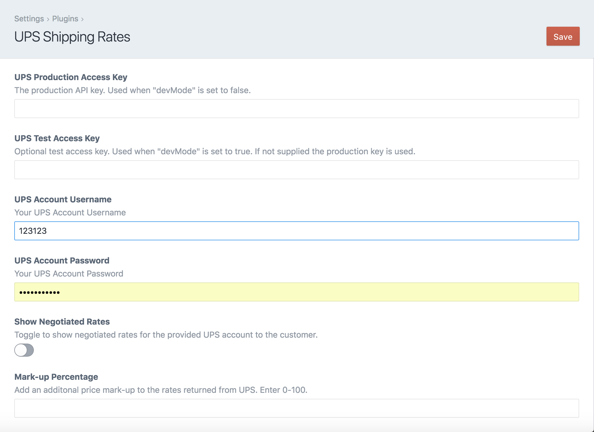
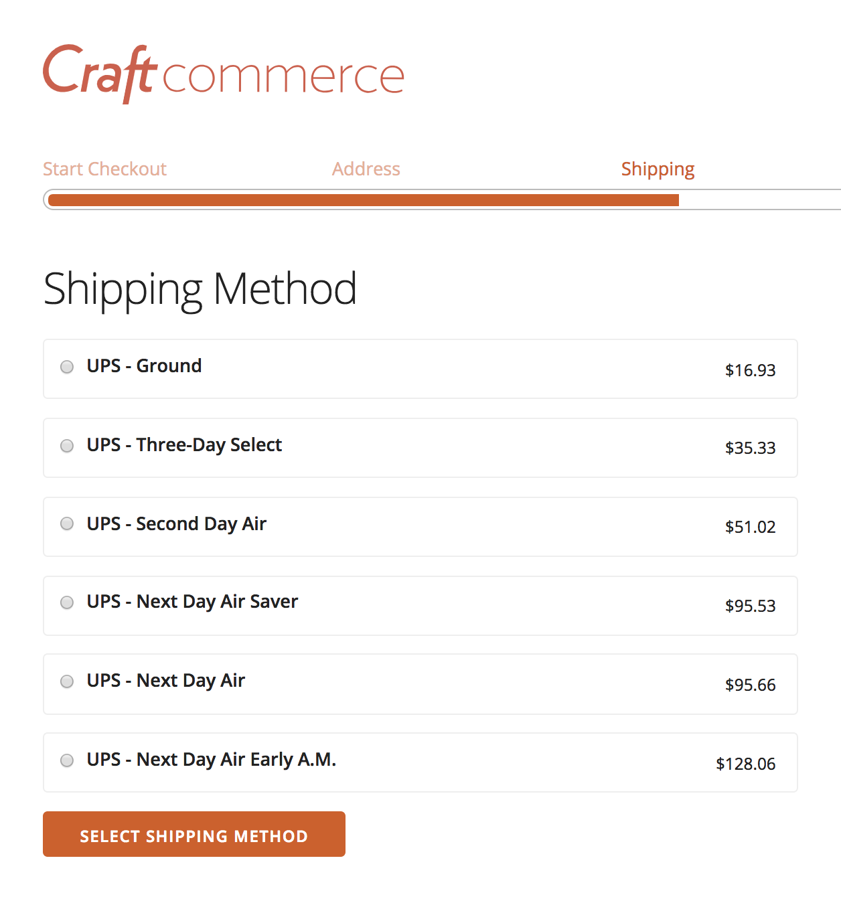
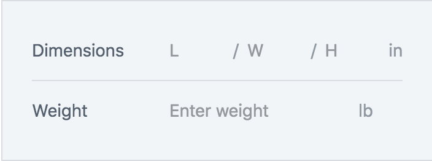

# UPS Shipping Rates plugin for Craft Commerce.

Adds UPS shipping methods and live rates to Craft Commerce. Inspired by Pixel & Tonic's [Easy Post](https://github.com/pixelandtonic/CommerceEasyPost).

This plugin is in beta and bugs may be present. Please document any issues you encounter at our [Github Issues](https://github.com/surprisehighway/craft-upsshippingrates/issues) page.

## Installation

To install the UPS Shipping Rates plugin follow these steps:

1. Download & unzip the file and place the `upsshippingrates` directory into your `craft/plugins` directory
2.  -OR- do a `git clone https://github.com/surprisehighway/craft-upsshippingrates.git upsshippingrates` directly into your `craft/plugins` folder.  You can then update it with `git pull`
3.  -OR- install with Composer via `composer require surprisehighway/craft-upsshippingrates`
4. Install plugin in the Craft Control Panel under Settings > Plugins
5. The plugin folder should be named `upsshippingrates` for Craft to see it. GitHub recently started appending `-master` (the branch name) to the name of the folder for zip file downloads.

UPS Shipping Rates works on Craft 2.6.x.

## Overview

The UPS Shipping Rates plugin provides UPS shipping methods to Craft Commerce. UPS shipping methods can be enabled individually and will be displayed, along with any other configured shipping option, at checkout.

UPS shipping rates are calculated live, via the UPS Rating API, for both U.S. Domestic and International addresses using the supplied customer address.

UPS Freight services are not currently supported.

## Configuring UPS Shipping Rates

In order to access the UPS rating service, you must have the following:
- An active UPS account username and password.
- A valid UPS API Access Key with “Production” access to “Rating - Package”

Visit [https://www.ups.com/upsdeveloperkit](https://www.ups.com/upsdeveloperkit) to setup your account and generate an access key.

Once you have obtained the above:

1. Copy config.php from the `upsshippingrates` directory to your craft/config folder and rename it to `upsshippingrates.php`
2. Specify a valid orgin address within the `fromAddress` array
3. Comment out any shipping methods within the `upsServices` array that you do not want to offer to customers
4. -OPTIONAL- Order pricing can be modified within 'modifyPrice'
5. Navigate to the settings page `/settings/plugins/upsshippingrates`
6. Supply your Production Access Key, Account Name, and Password
7. -OPTIONAL- Enter a test key if available
8. -OPTIONAL- Add a percentage based markup for shipping rates, 0-100
9. Save your settings

UPS shipping rates will now be calculated for products that have dimensions and weights specified.

## Using UPS Shipping Rates in Craft Commerce

After successfully configuring the plugin your shipping methods will appear within Craft Commerce's shipping method view at `/commerce/settings/shippingmethods`.

**A weight value is required for product and variants entries to calcuate shipping costs.**

The UPS Shipping Rates plugin will automatically convert from the "Weight Unit" specified in Craft Commerce's settings at `/commerce/settings/general`
. Width, Length, and Height dimensions are not required; however, large shipments should included these values to generate an accurate shipping rate.

If the a UPS service is available for the customer's shipping address, a live rate will be returned during the checkout process.

## Roadmap

* Improve the box packing algorithm
* Support rates for UPS Freight services
* Support flat rate and UPS Envelopes

Brought to you by [Rob Knecht](https://github.com/rmknecht) and [Surprise Highway](http://www.surprisehighway.com/)
